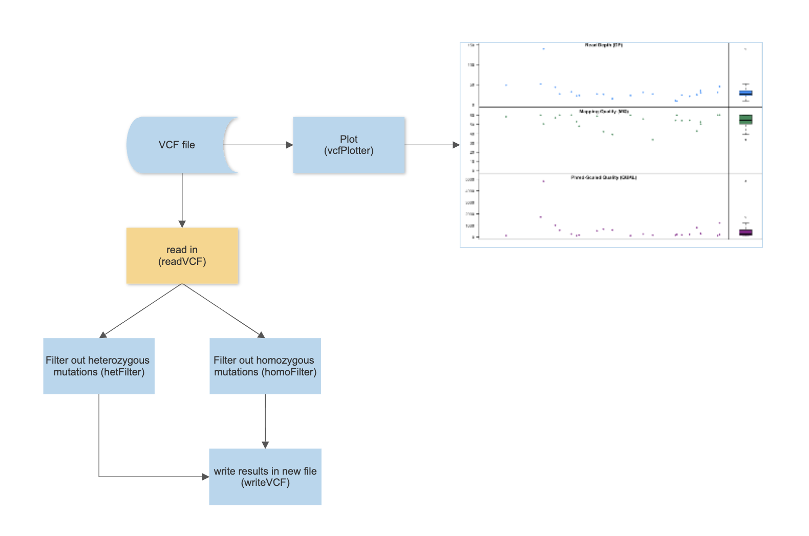

<!-- README.md is generated from README.Rmd. Please edit that file -->

# CHDNFilter

Filter for Extracting Hereozygous and Homozygous Mutations

<!-- badges: start -->
<!-- badges: end -->

An R package for identifying heterozygous mutations and homozygous
mutations from Whole exome sequencing (WES) and whole genome sequencing
(WGS) data.

## Installation

You can install the development version of CHDNFilter from
[GitHub](https://github.com/) with:

``` r
require("devtools")
devtools::install_github("sunjiayang0501/CHDNFilter", build_vignettes = TRUE)
library("CHDNFilter")
```

## Overview

To list all functions available in the package:

``` r
ls("package:CHDNFilter")
data(package = "CHDNFilter") # optional
browseVignettes("CHDNFilter")
```

‘CHDNFilter’ contains 5 functions. The *readVCF* function reads in VCF
file and divides it into three sections for convenience in analysis:
“Meta information” section, “Fixed information” section, and “Genotype
information” section. The *writeVCF* function writes manipulated variant
calls into a new text file with designated name. The *hetFilter*
function takes VCF file GT field as input, filters out all heterozygous
mutations, outputs the heterozygous mutations. The *homoFilter* function
takes VCF file GT field as input, filters out all homozygous mutations,
outputs the homozygous mutations. The *vcfPlotter* function plots VCF
file on 3 different aspects: read depth, mapping quality, and
Phred-Scaled quality.

An overview of the package is illustrated below:

<div style="text-align:center">



<div style="text-align:left">
<div style="text-align:left">

## Contributions

The author of the package is Sun Jiayang. The *readVCF* function,
*writeVCF* function, and *vcfPlotter* function makes use of ‘vcfR’
package.

## References

Knaus BJ, Grünwald NJ (2016). “VcfR: an R package to manipulate and
visualize VCF format data.
<https://cran.r-project.org/web/packages/vcfR/index.html> Nono_sad, et
al.”R write.table append dataframe to existing file”, stackoverflow, Apr
12, 2020
<https://stackoverflow.com/questions/61172304/r-write-table-append-dataframe-to-existing-file>
vicky, et al. “Finding the class of a variable in R” stackoverflow, May
22, 2016
<https://stackoverflow.com/questions/37378978/finding-the-class-of-a-variable-in-r>
“Save Plot in Data Object in Base R (Example)” statisticsglobe
<https://statisticsglobe.com/save-plot-in-data-object-in-base-r> ‘The
Variant Call Format (VCF) Version 4.2 Specification’
<https://samtools.github.io/hts-specs/VCFv4.2.pdf> user438383, et al.
“How is the GT field in a VCF file defined?” stackexchange, Sep 14, 2020
<https://bioinformatics.stackexchange.com/questions/14356/how-is-the-gt-field-in-a-vcf-file-defined>
“How to Select DataFrame Columns by Index in R?” GeeksforGeeks, 28 Nov,
2021
<https://www.geeksforgeeks.org/how-to-select-dataframe-columns-by-index-in-r/>
“Difference between Grep() vs Grepl() in R” GeeksforGeeks, 04 Jan, 2022
<https://www.geeksforgeeks.org/difference-between-grep-vs-grepl-in-r/>
Eric C., et al. “Using regexp to select rows in R dataframe”
stackoverflow, Mar 1, 2012
<https://stackoverflow.com/questions/9520840/using-regexp-to-select-rows-in-r-dataframe>
user971102, et al. “grep using a character vector with multiple
patterns” stackoverflow, Sep 29, 2011
<https://stackoverflow.com/questions/7597559/grep-using-a-character-vector-with-multiple-patterns>

## Acknowledgements:

This package was developed as part of an assessment for 2022 BCB410H:
Applied Bioinformatics course at the University of Toronto, Toronto,
CANADA. CHDNFilter welcomes issues, enhancement requests, and other
contributions. To submit an issue, use the GitHub issues.

<br> <br> The package tree structure is provided below.

``` r
- CHDNFilter
  |- CHDNFilter.Rproj
  |- DESCRIPTION
  |- NAMESPACE
  |- LICENSE
  |- README
  |- data
    |- hetFilterResults1.rda
    |- hetFilterResults2.rda
    |- hetFilterResults3.rda
    |- homFilterResults1.rda
    |- homFilterResults2.rda
    |- homFilterResults3.rda
    |- sample1.rda
    |- sample2.rda
    |- sample3.rda
  |- inst
    |- extdata
      |- Overview_CHDNFilter.png
      |- individual1.vcf
      |- individual1.vcf
      |- individual1.vcf
    |- shiny-scripts
      |- app.R
  |- man
    |- hetFilter.Rd
    |- hetFilterResults1.Rd
    |- hetFilterResults2.Rd
    |- hetFilterResults3.Rd
    |- homFilterResults1.Rd
    |- homFilterResults2.Rd
    |- homFilterResults3.Rd
    |- homoFilter.Rd
    |- readVCF.Rd
    |- sample1.Rd
    |- sample2.Rd
    |- sample3.Rd
    |- vcfPlotter.Rd
    |- writeVCF.Rd
  |- R
    |- data.R
    |- hetFilter.R
    |- homoFilter.R
    |- readVCF.R
    |- vcfPlotter.R
    |- writeVCF.R
  |- vignettes
    |- CHDNFilter.Rmd
  |- tests
    |- testthat.R
    |- testthat
      |- test-hetFilter.R
      |- test-homoFilter.R
```

You’ll still need to render `README.Rmd` regularly, to keep `README.md`
up-to-date. `devtools::build_readme()` is handy for this. You could also
use GitHub Actions to re-render `README.Rmd` every time you push. An
example workflow can be found here:
<https://github.com/r-lib/actions/tree/v1/examples>.
